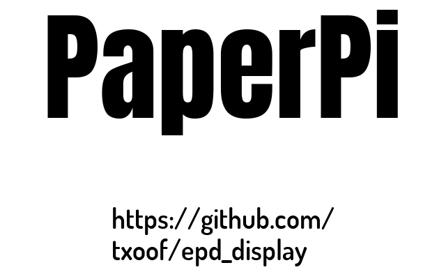

# PaperPi


E-Paper display with multiple, rotating display plugins. 

PaperPi is designed run as a daemon process to display a vairety of plugins to SPI based e-paper/e-ink displays with long refresh delays. It has been specifically written to work with the [WaveShare](https://www.waveshare.com/product/displays/e-paper.htm) SPI displays.

PaperPi rotates through a user-configured selection of plugins each represented by a single static "screen." After the plugin screen has "expired", the next plugin with the highest priority (lowest value) will be displayed, eventually cycling through all the plugins.

To get started, jump to the **[Setup Instructions](#setup)**


## Plugins
PaperPi supports many different plugins and layouts for each plugin. The plugin structure is open and documented to allow building your own plugins or customizing existing plugins.


 
###[Complete Plugins List](./documentation/Plugins.md)

| | | |
|:-------------------------:|:-------------------------:|:-------------------------:|
|[LibreSpot (spotify) Plugin](./paperpi/plugins/librespot_client/README.md)|[Word Clock](./paperpi/plugins/word_clock/README.md)|[Logitech Media Server Plugin](./paperpi/plugins/lms_client/README.md)|
|[Decimal-Binary Clock](./paperpi/plugins/dec_binary_clock/README.md)|[Met.no Weather](./paperpi/plugins/met_no/README.md)|[Basic Clock](./paperpi/plugins/basic_clock/README.md)|

<a name="requirements"></a>
## Requirements

### Required Hardware
* Raspberry Pi 4B
    - A Pi3 and possibly a Pi Zero are likely sufficient, but are untested at this time (Nov 2020)
* [WaveShare EPD SPI-only Screen](https://www.waveshare.com/product/displays/e-paper.htm) with PiHat
    - see the full list of currently [supported screens](#supportedScreens)
    - UART, SPI/USB/I80 screens are **not supported** as there is no python library for diving these boards
    
     
### Optional Hardware
* [HiFiBerry hat](https://www.hifiberry.com/shop/#boards) (*optional*) 
    * The HiFiBerry DAC+ PRO and similar boards add high-quality audio output to the Pi so it can act as a display and also work as a LMS client player using squeezelite
    * GPIO 2x20 headers **must be added** to the board to support WaveShare HAT
    * HiFiBerry's [DAC+ Bundle](https://www.hifiberry.com/shop/bundles/hifiberry-dac-bundle-4/) with the following configuraiton is a good choice:
        * DAC+ Pro 
        * Acrylic Case for (RCA) AND DIGI+
        * Raspberry Pi 4B 2GB (1GB should be sufficient as well)
        * 16GB SD Card
        * PowerSupply (USB C 5.1V/3A)
        * 2x20 Pin Male Header (required for WaveShare HAT)

### Optional Software
PaperPi plugins work with a variety of other software such as Logitech Media Server and Spotify. Check the [Plugin documentation](./documentation/Plugins.md) for further instructions

<a name="setup"> </a>
## Setup

### Hardware/OS Setup
The WaveShare displays require use of the SPI interface. SPI can be enabled through the `raspi-config` command.
1. Enable SPI (see images below)
    - `$ sudo raspi-config` > Interface Options > SPI > Yes
2. Reboot
    - `$ sudo shutdown -r now`
   
| |
|:-------------------------:|
||
||
||


### Userland Setup
PaperPi can be run directly on-demand from a user account such as the default "pi" user. Any other user will work as well, but the user must be a member of the spi group.
1. [Download the tarball](https://github.com/txoof/epd_display/raw/master/paperpi_latest.tgz)
    - `$ wget https://github.com/txoof/epd_display/raw/master/paperpi_latest.tgz`
2. Decompress the archive: `tar xvzf paperpi.tgz`
3. Launch PaperPi: `$ ./paperpi/dist/paperpi`
    - On the first run PaperPi will create a configuration file in `~/.config/com.txoof.paperpi/paperpi.ini` and then exit
4. Edit the configuration file to match your needs. The default configuration will provide a reasonable starting point
    - `$ nano ~/.config/com.txoof.paperpi/paperpi.ini`
        - At minimum you must specify the `display_type` 
        ```
        # choose the display type that matches your e-paper pannel 
        display_type = epd2in7
        ```
        - See the list of [supported screens](#supportedScreens) for more information
5. Launch PaperPi again -- you should immediately see a splash screen followed shortly by the first active plugin.
6. Press `ctrl+c` to shutdown paperpi cleanly
    - Waveshare recommends clearing pannels to a blank state prior to long-term storage

### Daemon Setup
PaperPi is designed to run 
1. [Download the tarball](https://github.com/txoof/epd_display/raw/master/paperpi_latest.tgz)
    - `$ wget https://github.com/txoof/epd_display/raw/master/paperpi_latest.tgz`
2. Decompress the archive: `tar xvzf paperpi.tgz`
2. Install PaperPi as a service, run the install script: `$ sudo ./install.sh` 
    - This will:
        * add the necessary service users and groups
        * add a configuration file to `/etc/defaults/paperpi.ini`
        * install PaperPi as a systemd service
2. Edit `/etc/defaults/paperpi.ini` to configure a `display_type` and enable any plugins
    - `$ sudo nano /etc/defaults/paperpi.ini`
    - At minimum you must specify the `display_type`
    - See the list of [supported screens](#supportedScreens) for more information
3. Start PaperPi: `$ sudo systemctl restart paperpi` 
    - PaperPi will now start and restart at boot as a systemd service


## Building PaperPi
If you would like to develop [plugins](./documentation/Plugins.md) for PaperPi, you will likely need a working build environment. 

### Requirements:
* python 3.7
* pipenv

1. Clone the repo: `https://github.com/txoof/epd_display.git`
2. Run `build.sh` to create a build environment
    - The build script will create a pipenv environment and prompt you to install necessary libraries
    - if pipenv fails to install Pillow, manually install pillow with `pipenv install Pillow`
3. The build script will then attempt to build a binary of PaperPi using pyintsaller 
    - executables are stored in `./dist/`

## Contributing
PaperPi's core is written and maintained in Jupyter Notebook. If you'd like to contribute, please make pull requests in the Jupyter notebooks. Making PRs to the `.py` files means manually moving the changes into the Jupyter Notebook and adds considerable work to the build/test process.

Plugins can be pure python, but should follow the [guide provided](./documentation/Plugins.md).

See [this gist](https://gist.github.com/txoof/ed4319db317f813b9e500ff190ca4a87) for a quick guide for setting up a jupyter environment on a Raspberry Pi.

<a name="supportedScreens"> </a>
## Supported Screens
All supported waveshare screens are only supported in 1 bit (black and white) mode. Grayscale and color output is not supported at this time.

Some WaveShare screens that support color output will also work with with the non-colored driver. Using the 1 bit driver can yield significantly better update speeds. For example: the `epd2in7b` screen takes around 15 seconds to update, but can be driven by the `epd2in7` driver  in 1-bit mode which takes less than 2 seconds to update.

| WaveShare Screen |
|:-|
| epd1in02  |
| epd1in54  |
| epd1in54_V2  |
| epd1in54b  |
| epd1in54b_V2  |
| epd1in54c  |
| epd2in13  |
| epd2in13_V2  |
| epd2in13b_V3  |
| epd2in13bc  |
| epd2in13d  |
| epd2in66  |
| epd2in7  |
| epd2in7b  |
| epd2in9  |
| epd2in9b_V2  |
| epd2in9bc  |
| epd2in9d  |
| epd3in7  |
| epd4in2  |
| epd4in2b_V2  |
| epd4in2bc  |
| epd5in65f  |
| epd5in83  |
| epd5in83b_V2  |
| epd5in83bc  |
| epd7in5  |
| epd7in5_HD  |
| epd7in5_V2  |
| epd7in5b_HD  |
| epd7in5bc  |
| epd7in5bc_V2  |
| epdconfig  |


