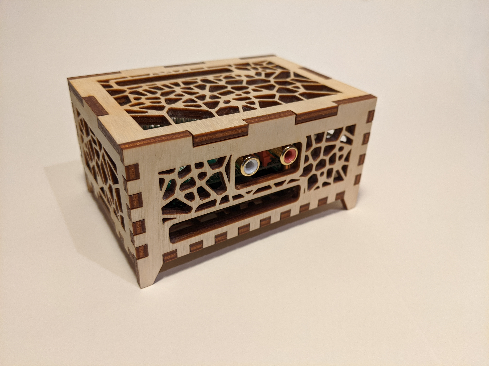
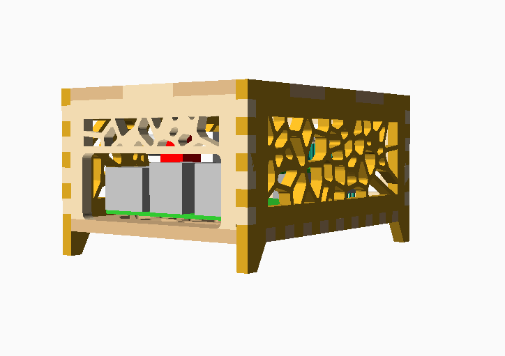
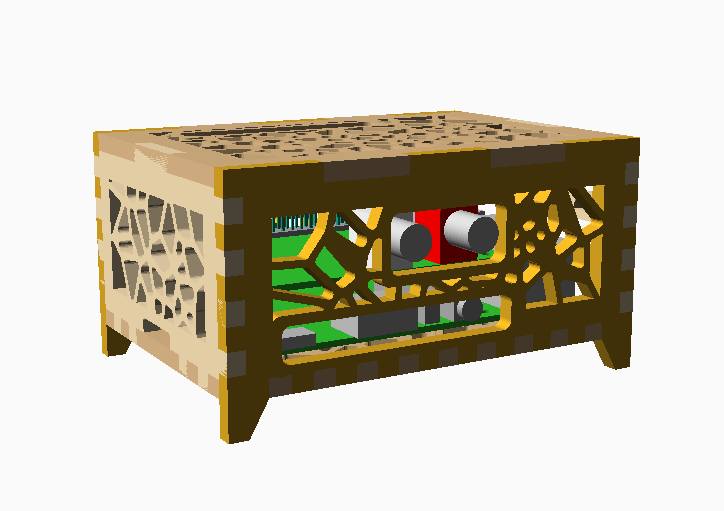
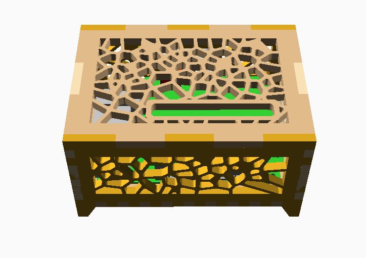

# Raspberry Pi 3 & 4 Case
A raspberry pi 3 and 4 case with room for a pi hat and access to the GPIO headers through the top.

## Notes:
* Adjust the `material` variable to match the thickness of your material
* To prepare for laser cutting, use `Design > Render (F6)`
  * Export the design `Export > Export as SVG`
* To view the model in 3D, use `layout(threeD=true)`
