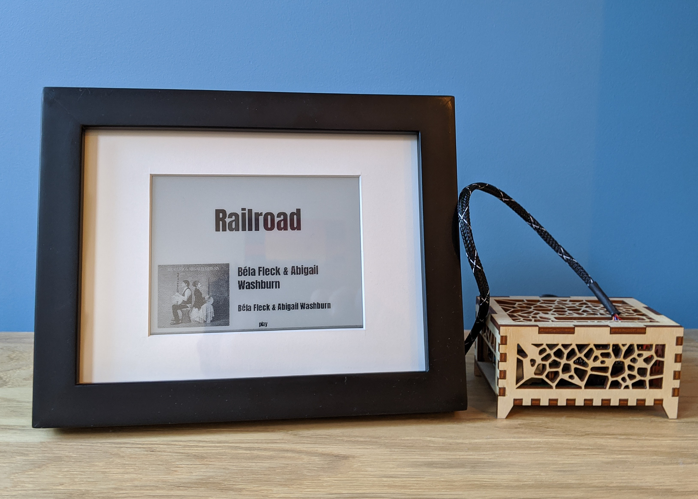

# Frame, Case, Cable

## Frame
[FrameLabs](https://framelabs.eu/en/) produces an excellent frame that can easily used with the 6". 9.7" and 13.3" WaveShare IT8951 compatible panels. The quality of the frames is excellent and there is plenty of space for mounting driver boards and routing cables. Contact info@framelabs.eu for more information.

See below for some tips for mounting a panel inside of a FrameLabs frame.

|     |
|:---:|
| Completed Frame|

|     |
|:---:|
| PLA Mounting Board|
| Use PLA board or something similar to provide a mount for the IT8951 Driver Board. |

|     |
|:---:|
| IT8951 mounted to frame|
| Mount the frame to the top right corner of the frame. Use M3 bolts to secure the PCB to the PLA board and secure the PLA board to the frame. |

|     |
|:---:|
| Panel secured to matboard|
| Secure the e-paper panel to the matboard using packing tape or something similar. Secure the flexible PCB to the back of the panel using capton tape or something similar.|

|     |
|:---:|
| Backing Board|
| Cut the backing board as needed to accomodate the PLA mount. |

|     |
|:---:|
| Frame Spacer|
| Some of the foam will need to be removed from the spacer to accomodate the PLA mount. Use a hobby knife to remove as much as needed. |

Carefully clean the glass and assemble the frame using the included magnet tape as per the instructions provided by FrameLabs.

## Case
[This laser cut case](https://github.com/txoof/pi4_case#readme) works with a Pi4 and a HiFi Berry DAC+ HAT. The opening in the front allows room for plugging in a 40 pin header cable.

The included SVG file is made for 4mm multi-plex (plywood). If your plywood is thicker or thiner, a new SVG can be generated with OpenSCAD by adjusting the `material` value.

## Cable Pinouts
Before connecting a WaveShare HAT with the JST cable, it is a good idea to check the [WaveShare Wiki](https://www.waveshare.com/wiki/2.7inch_e-Paper_HAT) to verify the pinouts. 

The included JST to Dupont cable is quite short. Cables up to 40 cm have been tested and work properly with both the IT8951 and Non-HD panels. To build your own cable you will need:

* 1x [JST 2.0 mm pitch PHR-8 Female Connector](https://www.jst-mfg.com/product/detail_e.php?series=199)
* 8x [JST BPH-002T-P0.5S Crimp contact](https://www.jst-mfg.com/product/detail_e.php?series=199) 
   - *buy some extra, crimping is difficult*
* 1x [Molex Female 2.54 mm pitch 2x20 Connector](https://nl.rs-online.com/web/p/wire-housings-plugs/1671893) or 2x [Molex Female 2.54 mm pitch 2x10 Connector](https://nl.rs-online.com/web/p/wire-housings-plugs/2134861)
* 8x [Molex Crimp Terminal Contact](https://nl.rs-online.com/web/p/wire-housings-plugs/2134861) 
   - *buy some extra, crimping is difficult*
* 8x 1 meter 20-24 AWG wire
* [Crimper](https://www.adafruit.com/product/350) 
   - *buy a good set like these. The other, cheaper, "automatic" crmimpers have terrible dies and destroy crimp ends just to make you cry.*
* 1 meter [Braided Cable Sheath](https://www.google.com/search?q=pet+expandable+braided+sleeving&oq=pet+expandable+braided+sleeving&gs_lcp=Cgdnd3Mtd2l6EAEYADIFCAAQgAQyBQgAEIAEMgQIABAeMgYIABAFEB4yBggAEAUQHjIGCAAQBRAeMgYIABAFEB4yBggAEAUQHjIGCAAQBRAeMgYIABAFEB5KBAhBGABKBAhBGABQAFgAYN8saABwAHgAgAFAiAFAkgEBMZgBAMABAQ&sclient=gws-wiz) *(optional)*

### IT8951 HD Panel 
This applies to the WaveShare HD panels such as: 6inch HD, 7.5inch HD, 9.7inch HD, 13.3inch 
JST header to 40 pin GPIO header pinout for Raspberry Pi
 
| **FUNCTION** | +5V | GND | MISO | MOSI | SCK | CS | RST | HRDY |
|:---|:---:|:---:|:---:|:---:|:---:|:---:|:---:|:---:|
| **COLOR** | RED | BLACK | BLUE | YELLOW | ORANGE | GREEN | WHITE |  PURPLE | 
| **PI GPIO** | +5V | GND | SPI0 MISO | SPI0 MOSI | SPI0 SCLK | SPI0 CE0 | GPIO 17 | GPIO 24 |
| **[Physical GPIO Header Pin](https://pinout.xyz/)** | 2 | 6 | 21 | 19 | 23 | 24 | 11 | 18 | 

### Non HD SPI Panels
This applies to the WaveShare non-hd panels such as: 2.7inch, 5.83inch, 7.5inch
JST header to 40 pin GPIO header pinout for Raspberry Pi

| **FUNCTION** | +3.3V | GND | DIN | CLK | CS | DC | RST | BUSY |
|:---|:---:|:---:|:---:|:---:|:---:|:---:|:---:|:---:|
| **COLOR** | RED | BLACK | BLUE | YELLOW | ORANGE | GREEN | WHITE |  PURPLE | 
| **PI GPIO** | +3.3 | GND | SPI0 MOSI | SPI0 SCLK | SPI0 CE0 | GPIO 25 | GPIO 17 | GPIO 24 |
| **[Physical GPIO Header Pin](https://pinout.xyz/)** | 1 | 6 | 19 | 23 | 24 | 22 | 11 | 18 | 

