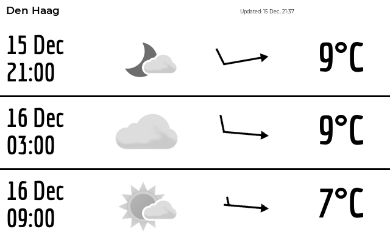

# Plugins
All plugins are configured through the `paperpi.ini` files. For a single-user configuration the file is stored in `~/.config/com.txoof.paperpi/` for system-wide daemon configuration the file is stored in `/etc/defaults/`.


## Plugins Currently Avialable
### [dec_binary_clock](../paperpi/plugins/dec_binary_clock/README.md)


### [met_no](../paperpi/plugins/met_no/README.md)


### [moon_phase](../paperpi/plugins/moon_phase/README.md)


### [default](../paperpi/plugins/default/README.md)


### [demo_plugin](../paperpi/plugins/demo_plugin/README.md)


### [splash_screen](../paperpi/plugins/splash_screen/README.md)


### [basic_clock](../paperpi/plugins/basic_clock/README.md)


### [newyorker](../paperpi/plugins/newyorker/README.md)


### [librespot_client](../paperpi/plugins/librespot_client/README.md)


### [reddit_quote](../paperpi/plugins/reddit_quote/README.md)


### [lms_client](../paperpi/plugins/lms_client/README.md)


### [word_clock](../paperpi/plugins/word_clock/README.md)


## Configuration
Configure plugins using in the configuration files:

 * user: `~/.config/com.txoof.paperpi/paperpi.ini`
 * daemon: `/etc/defaults/paperpi.ini`
 
Each plugin must have the following configuration at a minimum:

*NB: whitespace and comments are ignored*
```
[Plugin: Human Friendly Name For Plugin]
# layout to use
layout = layout
# this should match the directory and plugin name exactly
plugin = plugin_name
# maximum refresh rate in seconds
refresh_rate = int
# maximum priority for this plugin -- lower numbers are higher priority, -1 will always display
max_priority = int
```

### Configuration Elements
**Section Header**: `[Plugin: Human-Friendly Name for Plugin]`
* all plugin sections must **start** with `[Plugin: XXXX]` where XXX is a user-chosen descriptive string
* enabled: `[Plugin: name]`
* disabled: `[xPlugin: name]`

**Plugin Name**: `plugin = plugin_name`
* module name of plugin
* use `--list_plugins` to see available plugin names

**Layout Definition**: `layout = layout`
* screen layout that defines how to organize plugin graphical and text elements
* use `--plugin_info plugin_name` to see available layouts

**Refresh Rate**: `refresh_rate = integer in seconds`
* this controls how often the plugin is checked for new data
* some services such as spotify or MET.NO will ban users that request updates too frequently. Use caution when setting this.
* each plugin has a recommended `refresh_rate` use `--plugin_info plugin_name` to view a sample configuration

**max_priority**: `max_priority = integer`
* **LOWER** numbers are a higher priority (-1 is very high and will likely display immediately, 64000 will never be shown)
* a music plugin should likely be set to `0` to ensure that when a track change happens the display is updated
* a clock plugin that displays when music players are idle should be set to 2
* plugins with the lowest integer value will be displayed in the display loop
* some plugins change their priority when events happen such as when an audio track changes, music is paused, or a device becomes idle
* this value determines the maximum priority the plugin will use when it determines an important event has occured.
* recommended values can be found by using `--plugin_info plugin_name`


### Additional Configuration Elements
Some plugins require additonal configuration such as API keys, location information or other configuration details. Use `--plugin_info plugin_name` to find a sample configuration. Check the plugin README for additional information.

## Writing Plugins
PaperPi is designed to support additional plugins written in Python 3. Any modules available through PyPi may be used. 

When PaperPi starts, all plugins that are configured and active are added as `self.update_function` to a generic `Plugin` class. This happens automatically. The `Plugin` class offers several built-in functions and properties that plugins can take advantage of. See the "BUILTIN FUNCTIONS" section below.

See the included [`demo_plugin`](../paperpi/plugins/demo_plugin) for a simple, well documented plugin that can be used as a template for building a plugin.

**BUILTIN FUNCTIONS AVAILABLE TO PLUGINS**

All plugins have the following functions and properties available. Call the builtin functions by using `self.[method]`.

* resolution(`tuple` of `int`): resolution of the epd or similar screen: (Length, Width)
* name(`str`): human readable name of the function for logging and reference
* layout(`dict`): epdlib.Layout.layout dictionary that describes screen layout
* max_priority(`int`): maximum priority for this module values approaching 0 have highest priority, values < 0 are inactive
* refresh_rate(`int`): minimum time in seconds between requests for pulling an update
* min_display_time(`int`): minimum time in seconds plugin should be allowed to display in the loop
* config(`dict`): any kwargs that update function requires
* cache(`CacheFiles` obj): object that can be used for downloading remote files and caching
    - `cache_file(self, url, file_id, force=False)` download a remote file and return the local path to the file if a local file with the same name is found, download is skipped and path returned
        * Args:
            * url(`str`): url to remote file
            * file_id(`str`): name to use for local file
            * force(`bool`): force a download ignoring local files with the same name
    - `cleanup(self)` recursively remove all cached files and cache path (this is typically only used when shutting down the application)
        * Properties:
            * cache_path(`pathlib.PosixPath`): top-level path to cache files 


Plugins are written in python 3 and should follow the following guidelines to function properly:
**REQUIREMENTS**

* Plugin modules must** be added to the `plugins` directory
* Plugin modules must be named with exactly the same name as their module directory:
    - `plugins/my_new_plugin/my_new_plugin.py
* Include a `__init__.py` file that contains:
    - `from .my_new_plugin_name import update_function`
* Plugin modules must contain at minimum one function called `update_function()`
    - see below for a complete spec for the `update_function`
* Plugin modules will receive any configuration options specified in it's configuration section in the  `paperpi.ini` file at startup
    - Any values your plugin requires such as API keys, email addresses, URLs can be accessed from the `self.config` property 
* Plugin modules must at minimum contain a `layout.py` file that contains a layout file. 
    - The default layout should be named `layout`
        - it is acceptable to set `layout = my_complex_name` for the default playout
    - See the [epdlib Layout module](https://github.com/txoof/epdlib#layout-module) for more information on creating layouts
    - See the [`basic_clock` layout](../paperpi/plugins/basic_clock/layout.py) for a simple layout template
    - Layouts that require fonts should use paths in the following format: `'font': dir_path+'/../../fonts/<FONT NAME>/<FONT FILE>`
      * Feel free to add additional publicly available fonts to the `fonts` directory (https://fonts.google.com/ is a good source) 
* At minimum the `update_function` should contain a docstring that completely documents the plugin's use and behavior
    - See the example below
    - End all user-facing docstrings with `%U`; to ensure they are included in the auto-documenting build scripts

**OPTIONAL**

* Plugin modules may have user-facing helper functions that can help the user setup or configure the plugin
    - See the `lms_client` plugin and the `met_no` plugins for examples
* Plugin modules should contain a `constants.py` file that contains:
    - `version='version string'
    - `name='name of plugin'`
    - `data = {
            'key1': 'description of value',
            'key2': 'description of value',
            'keyN': 'description of value',
    }
    - `sample_config = '''
    [Plugin: My New Plugin]
    layout = layout
    plugin = my_new_plugin
    config_opt1 = some_value
    config_optN = 123456
    max_display_time = 45
    max_priority = 1
    '''
* Plugin modules should contain a `sample.py` file that contains sample data for creating documentation
    - See the specificaiton below
    
**`update_function` specifications**

The update_function is added to a `library.Plugin()` object as a method. The update_function will have access to the `self` namespace of the Plugin object including the `max_priority` and `cache`. The `Plugin()` API is well documented.

* `update_function` must accept `*args, **kwargs` even if they are not used
* `update_function` must return a tuple of: (is_updated(bool), data(dict), priority(int))
    - `is_updated` indicates if the module is up-to-date and functioning; return `False` if your module is not functioning properly or is not opperating
    - `data` is a dictionary that contains key/value pairs of either strings or an image (path to an image or PIL image object).
    - `priority` indicates your modules priority
        - The default should be to return `self.max_priority`; it is allowed to return a negative number if your plugin detects an important event.
        - If the module is in a passive state (e.g. there is no interesting data to show) set `priority` to `2**15` to ensure it is not included in the display loop
* Example docstring:
    ```
    '''
    update function for my_plugin_name provides foo information
    
    # longer description of what this plugin does
    This plugin provides...
    
    # required configuration elements that must be passed to this plugin
    Requirements:
        self.config(dict): {
            key1: value1
            key2: value2
        }
        self.cache(CacheFiles object): location to store downloaded images
    
    # arguments the update_function accepts
    Args:
       self(namespace): namespace from plugin object
     
    # return values
    Returns:
        tuple: (is_updated(bool), data(dict), priority(int))
    # marker '%U' that indicates this is a user-facing function that should be included when producing 
    # documentation
    %U'''
    ```

**`sample.py` specifications**

To provide a sample image and automatically create documentation provide a `sample.py` file with your module with the following information:
```
config = {
    # this is required
    'layout': 'layout_name_to_use_for_sample_img',
    # optional below this point
    'config_option': 'value',
    'config_option2': 12345
}
```

## Adding Plugins to PaperPi
Once you've built an tested your plugin, you can add it to PaperPi by submitting a pull request. You should do the following to make sure your plugin is ready to go:

* Run the `create_doc.py` script to make sure your README and sample images are built properly. 
    - `$ pipenv run python create_doc.py -p your_plugin_name` will create the documentation for your plugin
* Run the `build.py` script and test the pyinstaller binary in the `dist` folder runs properly
    - `$ pipenv run python build.py`
* Submit a PR