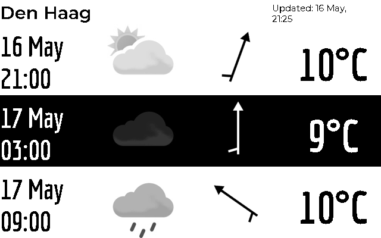
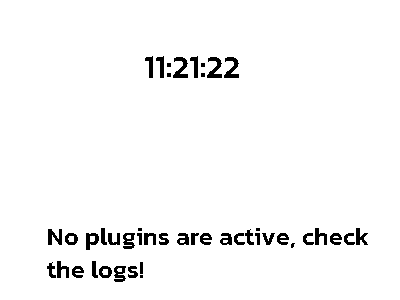

# Plugins
All plugins are configured through the `paperpi.ini` files. For a single-user configuration the file is stored in `~/.config/com.txoof.paperpi/` for system-wide daemon configuration the file is stored in `/etc/defaults/`.


## Configuration
Each plugin must have the following configuration at a minimum:

*NB!: whitespace and comments are ignored*
```
[Plugin: Human Friendly Name For Plugin]
layout = layout
plugin = plugin_name
refresh_rate = int
max_priority = int
```

### Configuration Elements
**Section Header**: `[Plugin: Human-Friendly Name for Plugin]`
* all plugin sections must **start** with `[Plugin: XXXX]` where XXX is a user-chosen descriptive string
* enabled: `[Plugin: name]`
* disabled: `[xPlugin: name]`

**Plugin Name**: `plugin = plugin_name`
* module name of plugin
* use `--list_plugins` to see available plugin names

**Layout Definition**: `layout = layout`
* screen layout that defines how to organize plugin graphical and text elements
* use `--plugin_info plugin_name` to see available layouts

**Refresh Rate**: `refresh_rate = integer in seconds`
* this controls how often the plugin is checked for new data
* some services such as spotify or MET.NO will ban users that request updates too frequently. Use caution when setting this.
* each plugin has a recommended `refresh_rate` use `--plugin_info plugin_name` to view a sample configuration

**max_priority**: `max_priority = integer`
* **LOWER** numbers are a higher priority (-1 is very high and will likely display immediately, 64000 will never be shown)
* a music plugin should likely be set to `0` to ensure that when a track change happens the display is updated
* a clock plugin that displays when music players are idle should be set to 2
* plugins with the lowest integer value will be displayed in the display loop
* some plugins change their priority when events happen such as when an audio track changes, music is paused, or a device becomes idle
* this value determines the maximum priority the plugin will use when it determines an important event has occured.
* recommended values can be found by using `--plugin_info plugin_name`


### Additional Configuration Elements
Some plugins require additonal configuration such as API keys, location information or other configuration details. Use `--plugin_info plugin_name` to find a sample configuration. Check the plugin README for additional information.

## Plugins Currently Avialable
### [dec_binary_clock](../paperpi/plugins/dec_binary_clock/README.md)


### [met_no](../paperpi/plugins/met_no/README.md)


### [default](../paperpi/plugins/default/README.md)


### [splash_screen](../paperpi/plugins/splash_screen/README.md)


### [basic_clock](../paperpi/plugins/basic_clock/README.md)


### [pi_dash](../paperpi/plugins/pi_dash/README.md)


### [librespot_client](../paperpi/plugins/librespot_client/README.md)


### [lms_client](../paperpi/plugins/lms_client/README.md)


### [word_clock](../paperpi/plugins/word_clock/README.md)


