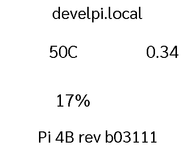

# mod_name

```

FUNCTION: update_function
update function for pi_dash
    display system information for this raspberry pi
    
    Requirements:
        None
        
    Args:
        self(`namespace`)
    
___________________________________________________________________________
 
```