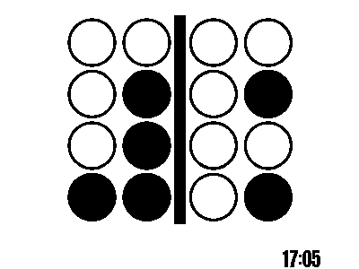

# dec_binary_clock

```

PLUGIN: dec_binary_clock v:0.1.0


FUNCTION: update_function
update function for dec_binary_clock 
    provides time as an image in four, four-bit numbers in little-endian format:
    
    EXAMPLE:
    Time 14:49
    o o | o x
    o x | x o
    o o | o o
    x o | o x 
    
    Requirements:
        None
        
    Args:
        self(`object namespace`)
        time(`str`): HH:MM formatted string to display (this is primarily for testing)
    
___________________________________________________________________________
 

LAYOUTS AVAILABLE:
  dec_binary_clock
  layout


DATA KEYS AVAILABLE FOR USE IN LAYOUTS PROVIDED BY plugins.dec_binary_clock.dec_binary_clock:
   bin_img
   time
```