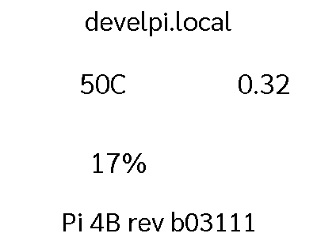

# pi_dash

```

PLUGIN: pi_dash v:0.1.0


FUNCTION: update_function
update function for pi_dash
    display system information for this raspberry pi
    
    Requirements:
        None
        
    Args:
        self(`namespace`)
    
___________________________________________________________________________
 

LAYOUTS AVAILABLE:
  layout


DATA KEYS AVAILABLE FOR USE IN LAYOUTS PROVIDED BY plugins.pi_dash.pi_dash:
   temp
   temp_icon
   load
   cpu_icon
   disk_use
   disk_icon
   pi_model
   hostname
```