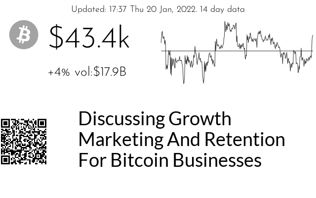
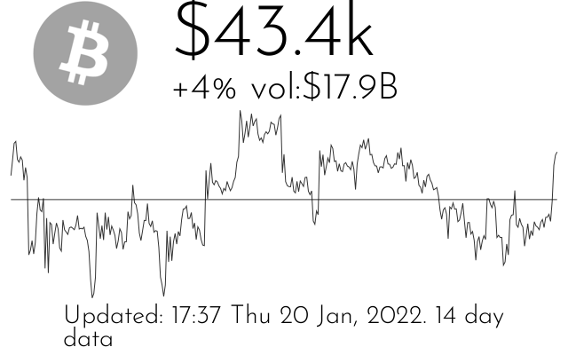

# crypto
 

```
 
PLUGIN: crypto v:0.1.0

 
FUNCTION: update_function
update function for crypto plugin provides: value of crypto token versus fiat currency
    along with sparkline, volume and 24 hour change as well as rss feed and qr code
    for related article (if available)
    
    During each update the current price is pulled from CoinGecko. Each hour the sparkline
    data is updated.
    
    This plugin can be specified multiple times in the configuration file
    to display multiple currencies:
    
    [Plugin: Crypto Bitcoin v USD]
    layout = layout
    # fiat currency to use for comparison
    fiat = usd
    # crypto currency to track
    coin = bitcoin
    # days of data to display
    days = 14
    # interval to show on sparkline
    interval = hourly
    # rss news feed to display
    rss_feed = https://bitcoinmagazine.com/.rss/full/
    
    [Plugin: Crypto Dogecoin v GBP]
    layout = layout
    # fiat currency to use for comparison
    fiat = gbp
    # crypto currency to track
    coin = dogecoin
    # days of data to display
    days = 14
    # interval to show on sparkline
    interval = hourly
    # rss news feed to display
    rss_feed = https://bitcoinmagazine.com/.rss/full/
    
    
    Configuration Requirements:
        self.config(`dict`):
                'fiat': ticker value for national currencey, e.g. usd, jpy, gbp
                'coin': CoinGecko ticker value for crypto token
                'days': number of days of historical value to pull
                'interval': interval for sparkline ('hourly' or 'daily')
                'rss_feed': RSS feed to display
                
    Args:
        self(namespace): namespace from plugin object
        
    Returns:
        tuple: (is_updated(bool), data(dict), priority(int))
    
___________________________________________________________________________
 
 

SAMPLE CONFIGURATION FOR paperpi.plugins.crypto.crypto

[Plugin: Crypto Bitcoin v USD]
plugin = crypto
layout = layout
# fiat currency to use for comparison
fiat = usd
# crypto currency to track
coin = bitcoin
# days of data to display
days = 14
# interval to show on sparkline
interval = hourly
# rss news feed to display
rss_feed = https://bitcoinmagazine.com/.rss/full/
min_display_time = 30
# refresh data every 5 minutes
refresh_rate = 300
max_priority = 2

 
LAYOUTS AVAILABLE:
  layout
  ticker_hd
  ticker_simple
 

DATA KEYS AVAILABLE FOR USE IN LAYOUTS PROVIDED BY paperpi.plugins.crypto.crypto:
```

## Provided Layouts:

layout: **layout**

 


layout: **ticker_hd**

 


layout: **ticker_simple**

 


## Additional Plugin Information
This plugin can track multiple crypto currencies by adding multiple entries in the configuration file:

```
[Plugin: Crypto Dogecoin v EUR]
plugin = crypto
layout = layout
# fiat currency to use for comparison
fiat = eur
# crypto currency to track
coin = dogecoin
# days of data to display
days = 14
# interval to show on sparkline
interval = hourly
# rss news feed to display
rss_feed = https://bitcoinmagazine.com/.rss/full/
min_display_time = 60
refresh_rate = 240
max_priority = 2

[Plugin: Crypto Bitcoin v USD]
plugin = crypto
layout = layout
# fiat currency to use for comparison
fiat = usd
# crypto currency to track
coin = bitcoin
# days of data to display
days = 14
# interval to show on sparkline
interval = hourly
# rss news feed to display
rss_feed = https://http://feeds.bbci.co.uk/news/world/rss.xml
min_display_time = 60
refresh_rate = 240
max_priority = 2

```