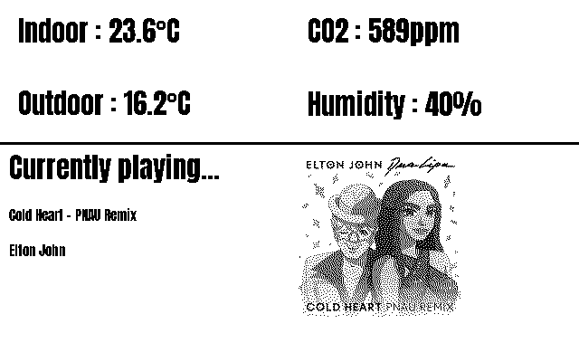

# home_assistant
 

```
 
PLUGIN: home_assistant v:0.1.0

 
FUNCTION: update_function
update function for home assistant plugin
    
    This plugin connects to home assistant and can fetch four sensor values of choice as well as
    displaying what is currently playing on a select media player
    
    Requirements:
        self.config(dict): {
            'home_assistant_basepath': 'base url to home assistant',
            'home_assistant_token': 'authentication token for home assistant',
            'entity1_name': 'display name for sensor 1',
            'entity1_id': 'home assistant id for sensor 1',
            'entity2_name': 'display name for sensor 2',
            'entity2_id': 'home assistant id for sensor 2',
            'entity3_name': 'display name for sensor 3',
            'entity3_id': 'home assistant id for sensor 3',
            'entity4_name': 'display name for sensor 4',
            'entity4_id': 'home assistant id for sensor 4',
            'media_id': 'home assistant media player id'
        }
        
    Args: 
        self(namespace): namespace from plugin object
    
    Returns:
        tuple: (is_updated(bool), data(dict), priority(int))

    
___________________________________________________________________________
 
 

SAMPLE CONFIGURATION FOR paperpi.plugins.home_assistant.home_assistant

[Plugin: Home Assistant]
layout = layout
plugin = home_assistant
min_display_time = 30
max_priority = 1
home_assistant_basepath = https://IP:8123
# home assistant access token
home_assistant_token = 
# all four sensors are mandatory to add
entity1_name = Friendly name (ex Indoor)
entity1_id = home assistant sensor id
entity2_name = Friendly name (ex Outdoor)
entity2_id = home assistant sensor id
entity3_name = Friendly name (ex Outdoor)
entity3_id = home assistant sensor id
entity4_name = Friendly name (ex Outdoor)
entity5_id = home assistant sensor id
media_id = media player id

 
LAYOUTS AVAILABLE:
  four_sensors_and_media_player
  layout
 

DATA KEYS AVAILABLE FOR USE IN LAYOUTS PROVIDED BY paperpi.plugins.home_assistant.home_assistant:
   no keys available
```

## Provided Layouts:

layout: **four_sensors_and_media_player**

 


layout: **layout**

 


## Additional Plugin Information

Home assistant is a open source home automation system. In order to set it up with paperpi
please follow the instructions on the link below to retrieve your access token.

[Home Assistant Rest API](https://developers.home-assistant.io/docs/api/rest/)

Included image was sourced from the [Flat Icon](https://www.flaticon.com/free-icons/dvd)
