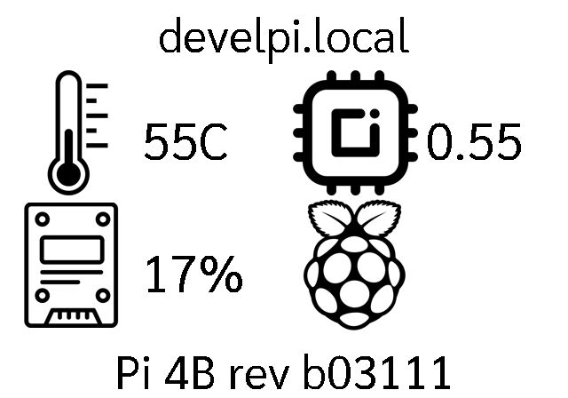

# pi_dash

```

PLUGIN: pi_dash v:0.1.0


FUNCTION: update_function
update function for pi_dash providing basic system information
    
    This plugin displays system information for this raspberry pi and 
    requires that the user running this plugin has access to the GPIO
    group.
        
    Args:
        self(`namespace`)
        
    Returns:
        tuple: (is_updated(bool), data(dict), priority(int))
        
    
___________________________________________________________________________
 


SAMPLE CONFIGURATION FOR plugins.pi_dash.pi_dash

[Plugin: Pi Dashboard]
layout = layout
plugin = pi_dash
refresh_rate = 25
min_display_time = 30
max_priority = 2


LAYOUTS AVAILABLE:
  layout


DATA KEYS AVAILABLE FOR USE IN LAYOUTS PROVIDED BY plugins.pi_dash.pi_dash:
   temp
   temp_icon
   load
   cpu_icon
   disk_use
   disk_icon
   pi_model
   hostname
```