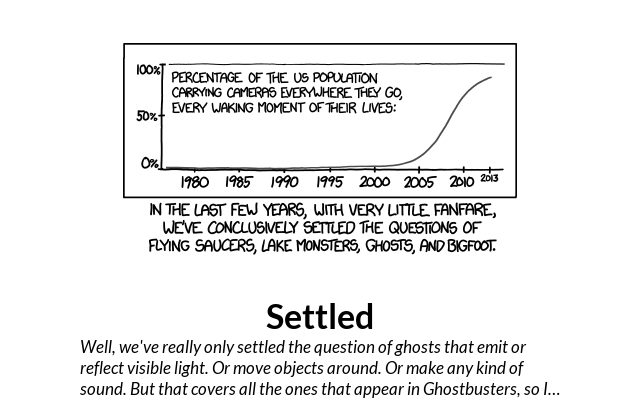
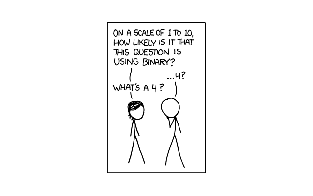
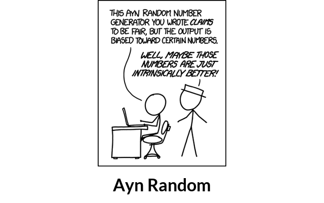
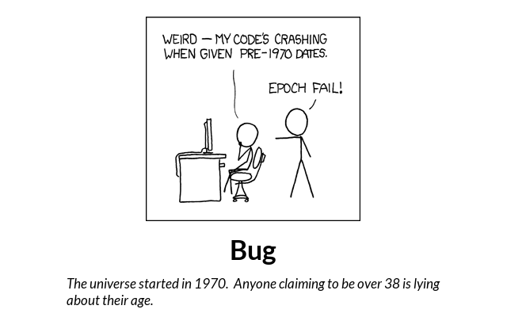

# xkcd_comic
 

```
 
PLUGIN: xkcd_comic v:0.1.0

 
FUNCTION: update_function
update function for xkcd_comic provides a comic, title and "alt-text" for a random XKCD commic
    
    During each update a random comic from the entire XKCD comic corpus. Comics are resampled to fit 
    appropriately onto the screen. 
    
    A maximum resolution of comic can be specified in the configuration (max_x, max_y). Any comic 
    larger than this maximum is rejected an another comic is chosen. This is useful because some 
    XKCD comics are enormous and cannot be resized appropriately to fit on small screens. The default 
    is 800x600 pixels.  
    
    Configuration Requirements:
        self.config(`dict`): {
            'max_x': (`int`) maximum x dimension for selected comic #optional,
            'max_y': (`int`) maximum x dimension for selected comic #optional),
            'max_retires': (`int`) number of attempts to select comic before giving up #optional,
            'resize': (0 or 1) enlarge small comics to meet max_x and max_y #optional
        }
        self.cache(`CacheFiles` object)
        
    Args:
        self(namespace): namespace from plugin object
    
    Returns:
        tuple: (is_updated(bool), data(dict), priority(int))
    
___________________________________________________________________________
 
 

SAMPLE CONFIGURATION FOR paperpi.plugins.xkcd_comic.xkcd_comic

[Plugin: XKCD Comic Plugin]
# default layout
layout = layout
plugin = xkcd_comic
refresh_rate = 1200
min_display_time = 120
# maximum x dimension of comic image
max_x = 800
# maximum y dimension of comic image
max_y = 600
# max attempts to find a suitable comic image
# 0 do not rsize small comics / 1 maximize small comics to max_x, max_y
resize = 0
max_retries = 10
max_priority = 2

 
LAYOUTS AVAILABLE:
  comic_only
  comic_title
  comic_title_alttext
  layout
 

DATA KEYS AVAILABLE FOR USE IN LAYOUTS PROVIDED BY paperpi.plugins.xkcd_comic.xkcd_comic:
   image_file
   alt
   num
   safe_title
```

## Provided Layouts:

layout: **comic_only**

 


layout: **comic_title**

 


layout: **comic_title_alttext**

 


layout: **layout**

 


## Additional Plugin Information
All comics are property and used courtesy of Randal Munroe and (https://xkcd.com). 